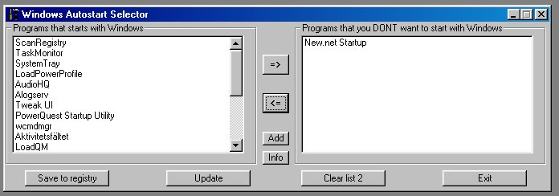



## Windows Autostart Selector

### Description

The program lets you choose which programs you want to autostart with windows and creates a list of the ones that are in the autostart folder in the registry. Then you can move them to another list so they wont autostart.

You can also add programs that you wish to be autostarted.

Please rate my program.
 
### More Info
 
I have copyed some of the code in the module but I dont know who the author was...

             |
---                |---
**Submitted On**   |2001-10-03 18:57:02
**By**             |[Martin Dahl](https://github.com/Planet-Source-Code/PSCIndex/blob/master/ByAuthor/martin-dahl.md)
**Level**          |Intermediate
**User Rating**    |4.7 (33 globes from 7 users)
**Compatibility**  |VB 5\.0, VB 6\.0
**Category**       |[Windows System Services](https://github.com/Planet-Source-Code/PSCIndex/blob/master/ByCategory/windows-system-services__1-35.md)
**World**          |[Visual Basic](https://github.com/Planet-Source-Code/PSCIndex/blob/master/ByWorld/visual-basic.md)
**Archive File**   |[Windows Au274541032001\.zip](https://github.com/Planet-Source-Code/martin-dahl-windows-autostart-selector__1-27763/archive/master.zip)

